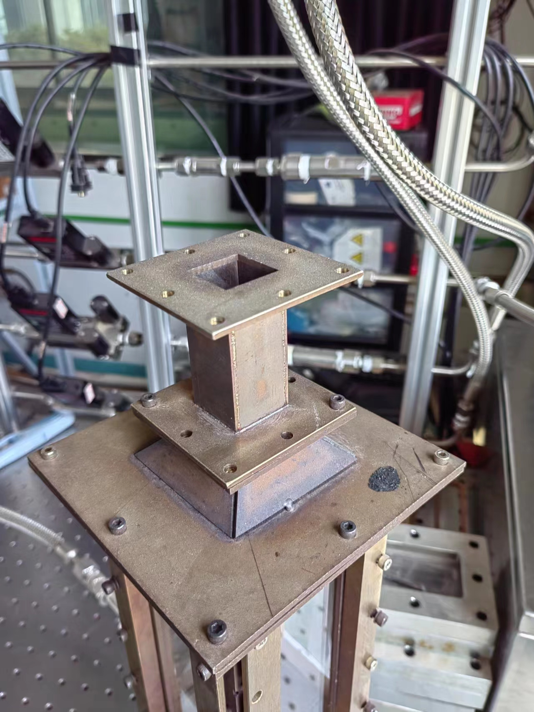
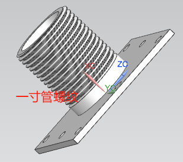
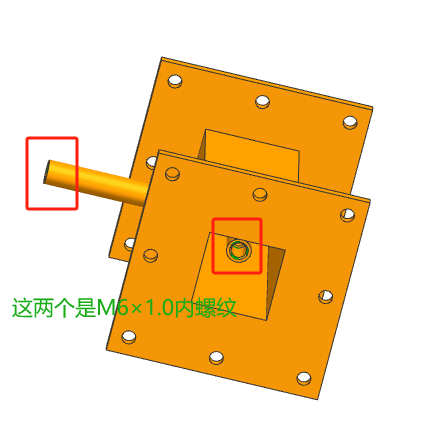
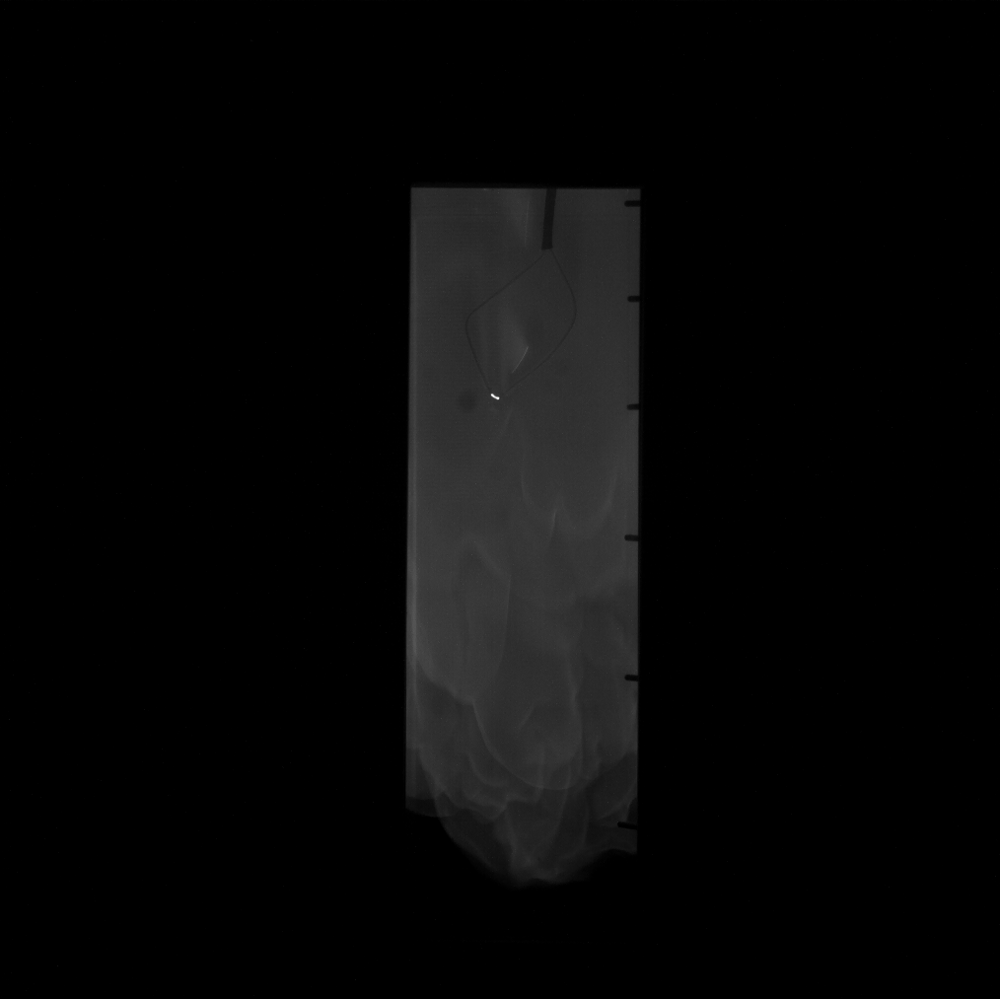
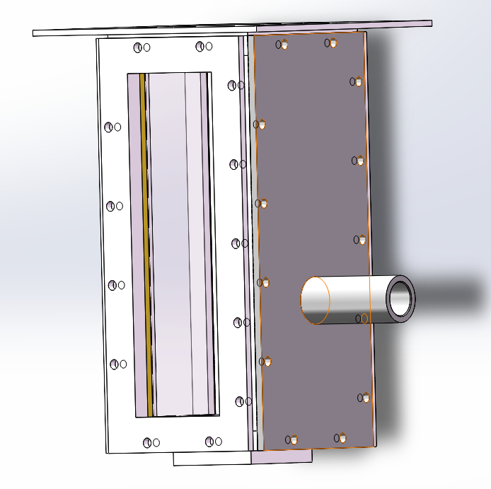
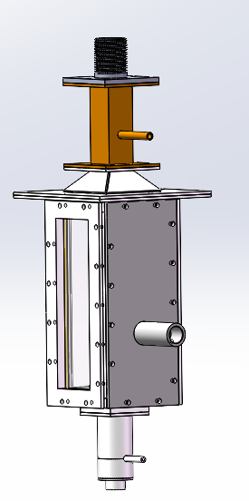
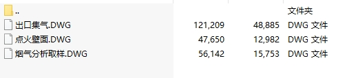
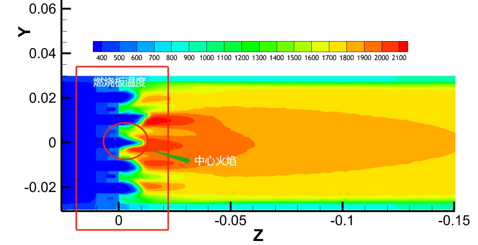
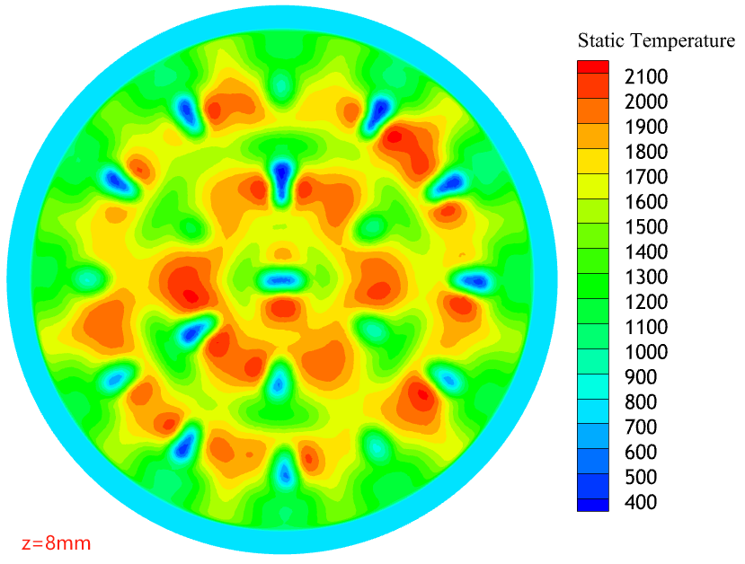
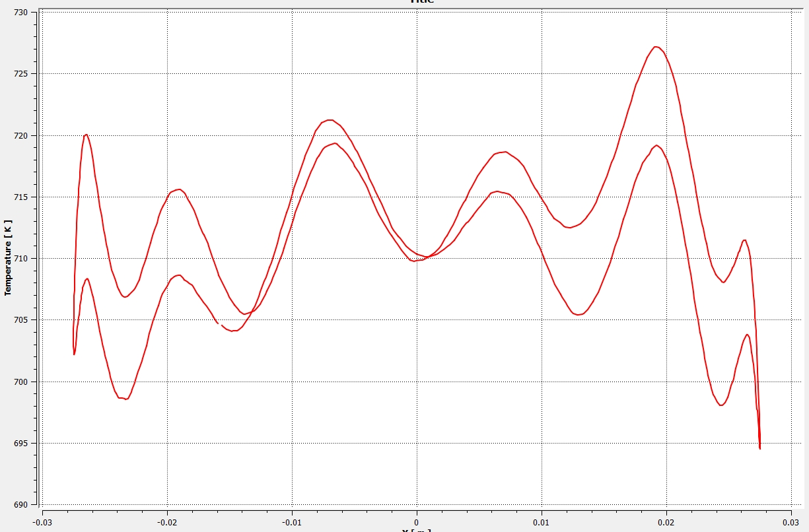

---
html:
    embed_local_images: true
---
## 日常工作

### 上周内容

**1. 设计旋流燃烧室相关接口**

   - **尾气引出**

     ​	这个是为了测试高温PIV，避免金属尘埃污染到市内的激光器，故设计接口引出室外。如下图，在燃烧室上方加个转接管螺纹，以连接实验室原购的一寸波纹管，将带有金属微粒的尾气引出。

<b>燃烧室上加个转接一寸管螺纹</b>

   - **烟气取样**

     ​	陈玉乾老师买了个烟气分析仪（可测氢气燃烧），故又设计了一个烟气取样干，加装在尾气出口，且尾气取样杆可以通过螺纹加伸缩节。如图所示，取样杆的长度可以根据根据螺纹，添加不同长度的竹节钢管（加工or淘宝有卖现成的M6*1.0连接钢管）。

<b>取样杆（两端M6*1.0螺纹连接）</b>

   - **点火盲板**

     由于以上两个接口的存在，导致以前的点火方式发生了变化，不得不重新设计点火。经过讨论拆掉了一面玻璃设计了一个可安装点火器的盲板。

<b>点火盲板更改</b>

 - **整体方案**

   ​	整体的效果图如下，这个实验预期下周进行，甲烷点火，燃料烧氢氨掺混，旋流燃烧；主要测量手段是高温PIV和新烟气分析仪。

<b>装配效果</b>

**2. 微混燃烧室加传热模拟计算**

- **整理测试超算资源**

  ...

- **fluent计算带传热的燃烧**

  
<b>具体工况表：</b>

  | 当量比 | 空气流量g/s | 单孔空气流速m/s | 通氢气孔数 | 是否加传热 |
  | :----: | :---------: | :-------------: | :--------: | :--------: |
  |  1.0   |    1.447    |        3        |     19     |  &times;   |
  |  0.6   |    4.823    |       10        |     19     |  &radic;   |
  |  0.6   |   7.2356    |       15        |     19     |  &radic;   |
  |  0.6   |   7.2356    |       15        |     1      |  &radic;   |
  |  0.6   |   7.2356    |       15        |     6      |  &radic;   |
  |  0.6   |   7.2356    |       15        |    1+6     |  &radic;   |
  |  0.6   |   7.2356    |       15        |     12     |  &radic;   |
  |  0.6   |   7.2356    |       15        |    1+12    |  &radic;   |
  |  0.6   |   14.471    |       30        |     19     |  &radic;   |
  |  0.6   |   7.2356    |       15        |     19     |  &times;   |
  |  0.6   |   7.2356    |       15        |     19     |    冷态    |
  

ps：其中一个孔表示中心孔；6个孔表示中间六个孔；12个是最外层十二个孔；1+6表示内两层通气燃烧，1+12表示中心孔和最外层孔通气燃烧；19个孔表示全部通气燃烧。
- **相关计算结果**
暂时现展示一些算例样图，具体的数据分析待后续分析后，再集中展示。

<b>模拟云图</b>

沿弧度z=8mm截面温度分布（还有些问题，待进一步改）

<b>plot曲线图</b>

### 下周计划

- **氢氨掺混燃烧实验（小论文能发一些）**
  - 调试（实验室装修长时间未动，需要整体调试）
  - 加工件组装
  - PIV测试高温PIV金属粒子
  - 新烟气分析仪测试
- **纯氢微混模拟数据分析和改进**

